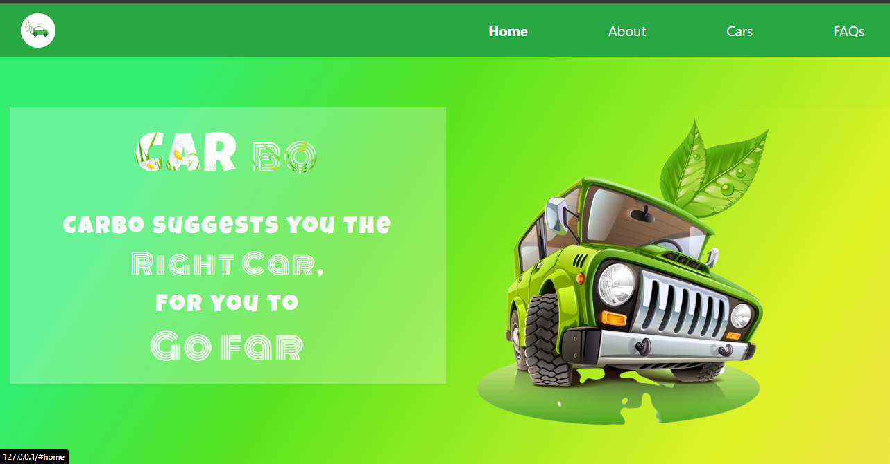
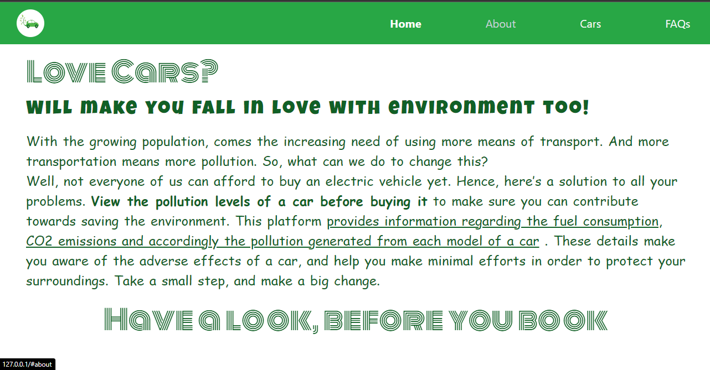
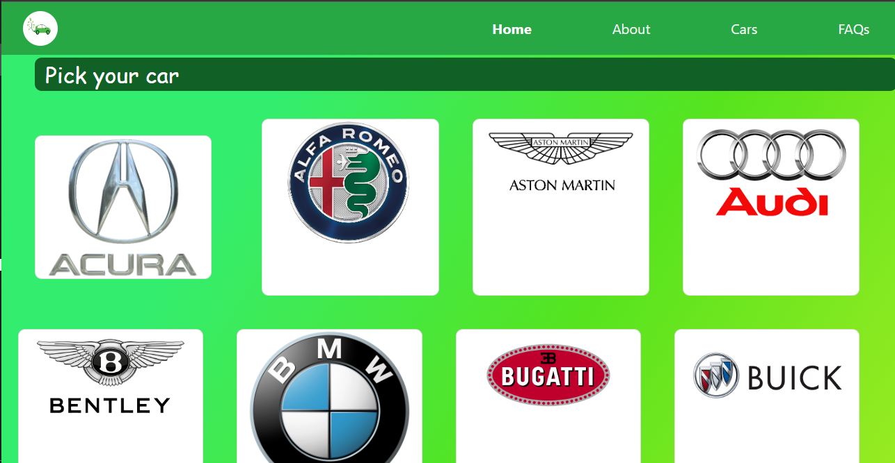
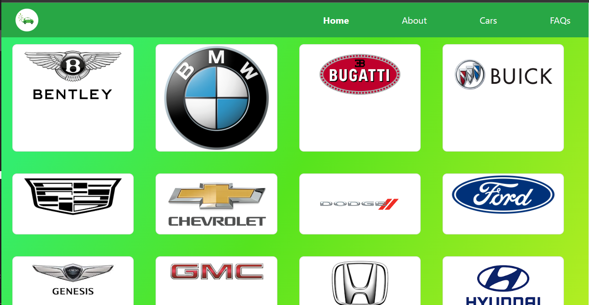
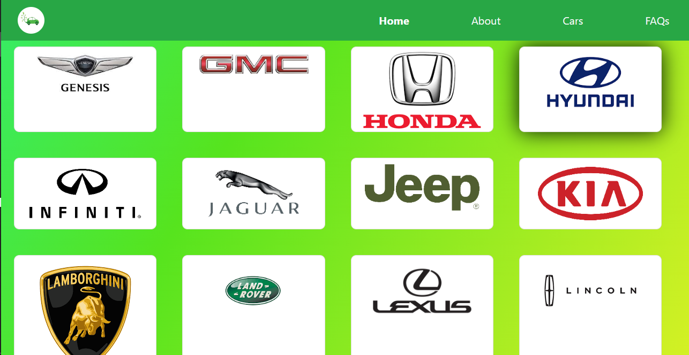
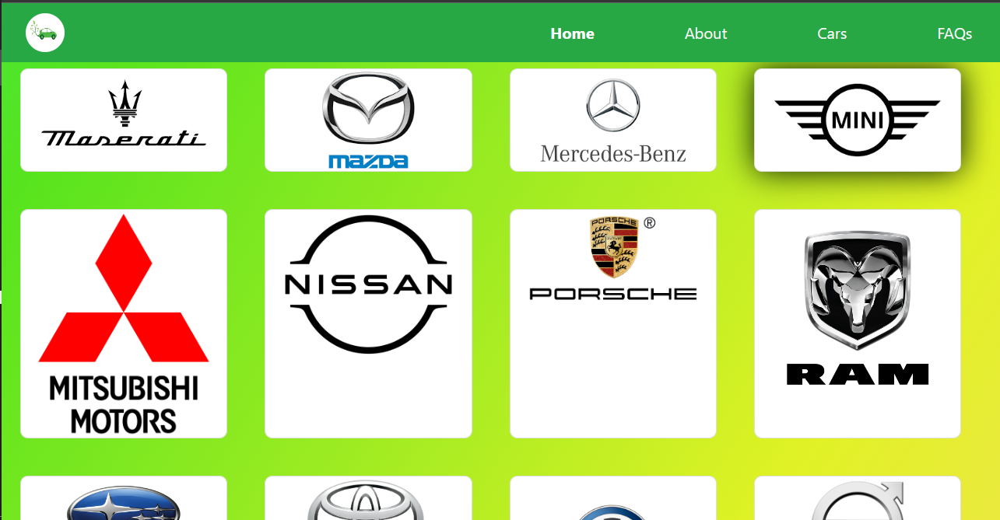
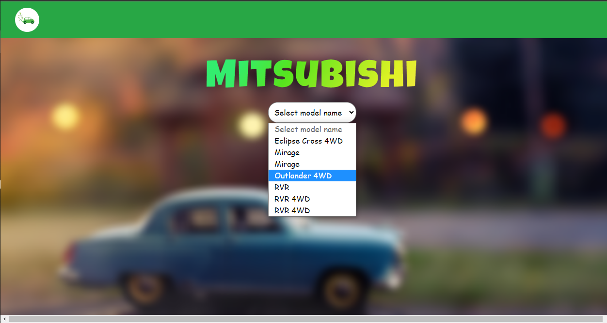
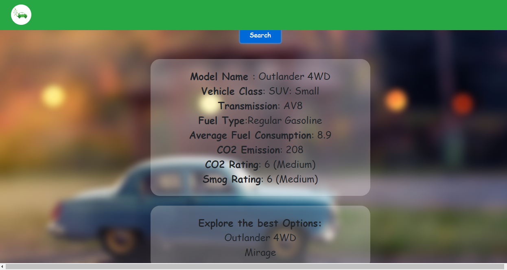
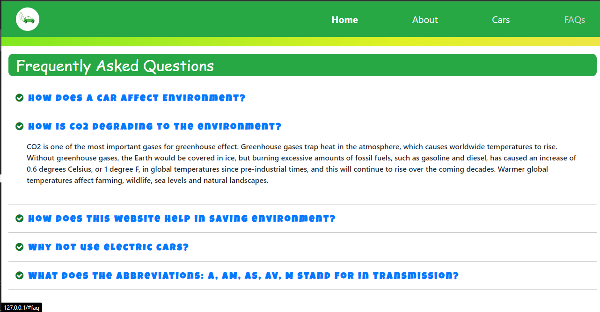

# CARbo

A Web based project that displays various cars brands and allow user to select its model and access its details

## Screenshots

### Home Page 🏚



<br>

### About Page 🖋


<br>

### Various Cars available 🚗


<br>



<br>



<br>



<br>

### Selecting a brand, will redirect the user to this page where there is an option to select model



<br>

### Here are the Details ✨



<br>

### FAq's ⁉



<br>

## Deployment

To deploy this project run

- Download the [Dataset](https://open.canada.ca/data/en/dataset/98f1a129-f628-4ce4-b24d-6f16bf24dd64/resource/87fc1b5e-fafc-4d44-ac52-66656fc2a245) and import in MySQL 
- In app.js set the password of your MySQL account
- Then run on terminal
```
  node app.js
```
- Browse to 127.0.0.1


